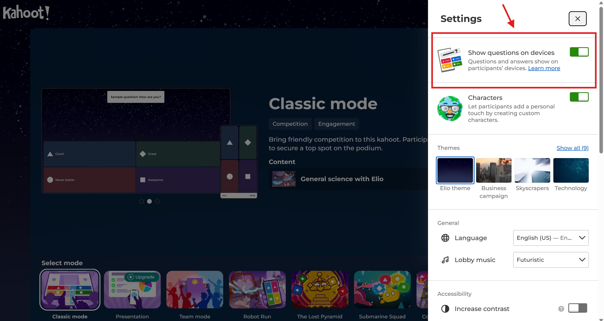

# AI-Powered Kahoot Agent 🤖

> An intelligent quiz agent that uses OpenAI's gpt-oss models to autonomously participate in Kahoot games with real-time reasoning capabilities.

[](https://github.com/openai/gpt-oss)

## 🚀 Overview

This project showcases the reasoning capabilities of OpenAI's open-weight gpt-oss models by creating an AI that can compete in real-time Kahoot quiz games. The agent analyzes questions, applies reasoning to multiple choice and true/false scenarios, and submits answers within the game's time constraints.

## ✨ Features

- 🧠 **Real-Time AI Reasoning**: Uses gpt-oss-20b for question analysis and answer prediction
- ⚡ **Fast Response Times**: Optimized for Kahoot's time-critical environment
- 🎯 **Multi-Format Support**: Handles both multiple-choice (4 options) and true/false questions
- 🔄 **Asynchronous Processing**: Pre-processes questions for optimal timing
- 📷 **Image-Ready Architecture**: Framework prepared for visual questions (future enhancement)
- 🌐 **Local Operation**: Fully offline AI reasoning via Ollama

## 🛠️ Installation

### Prerequisites

1. **Python 3.10+**
2. **Ollama** - For running gpt-oss models locally
3. **gpt-oss-20b model** - Downloaded via Ollama

### Setup

1. **Clone the repository**
```bash
git clone https://github.com/area51b/game-agent.git
cd game-agent
```

2. **Install Python dependencies in a virtual environment**
```bash
python -m venv .venv
source .venv/bin/activate

pip install -r requirements.txt
```

3. **Install and setup Ollama**
```bash
# Install Ollama (visit https://ollama.ai for platform-specific instructions)
curl -fsSL https://ollama.com/install.sh | sh

# Pull the gpt-oss model
ollama pull gpt-oss:20b
```

4. **Verify Ollama is running**
```bash
# Start Ollama service
nohup ollama serve > ollama.log 2>&1 &

# Test the model
ollama run gpt-oss:20b "Hello World"
```

## 🎮 Usage

1. **Run the Kahoot Agent**
```bash
python kahoot_agent.py
```

2. **Enter game details when prompted**
   - Game PIN (from Kahoot game)
   - Agent name (will appear in the game)

3. **Watch the AI compete!**
   - The agent will join the game
   - Analyze questions in real-time
   - Submit answers automatically
   - Display its reasoning and choices

## 🏗️ Architecture

```
┌─────────────────┐    ┌─────────────────┐    ┌─────────────────┐
│   Kahoot Game   │◄──►│   Agent Client  │◄──►│  Ollama/GPT-OSS │
│     Server      │    │                 │    │      Model      │
└─────────────────┘    └─────────────────┘    └─────────────────┘
         │                       │                     │
         │              WebSocket Connection     HTTP API Calls
         │                       │                     |
         ▼                       ▼                     ▼
┌─────────────────┐    ┌─────────────────┐    ┌─────────────────┐
│ Question Ready  │    │ Answer Analysis │    │ Local Reasoning │
│    Events       │    │   & Prediction  │    │   Processing    │
└─────────────────┘    └─────────────────┘    └─────────────────┘
```

## 🔧 Key Components

### 1. Question Analysis Engine
- Parses incoming question data
- Extracts question text and answer choices
- Handles both multiple-choice and true/false formats

### 2. AI Reasoning Module
- Communicates with local gpt-oss model via Ollama API
- Constructs optimized prompts for quiz scenarios
- Parses and validates AI responses

### 3. Response Timing System
- Pre-processes questions during "ready" phase
- Submits answers immediately when questions start
- Optimized for Kahoot's time constraints

## 📊 Performance

- **Response Time**: < 2 seconds for question analysis
- **Accuracy**: Varies by question difficulty and domain
- **Reliability**: Handles network issues and malformed responses
- **Scalability**: Can theoretically handle multiple concurrent games

## 🧪 Testing

### Test with Sample Questions
```python
# Test the AI reasoning function directly
import asyncio
from kahoot_agent import get_ollama_answer

async def test_question():
    question = "What is the capital of France?"
    choices = ["London", "Berlin", "Paris", "Madrid"]
    answer = await get_ollama_answer(question, choices)
    print(f"AI chose: {choices[answer]}")

asyncio.run(test_question())
```

### Verify Ollama Connection
```bash
curl -X POST http://localhost:11434/api/generate \
  -H "Content-Type: application/json" \
  -d '{"model": "gpt-oss:20b", "prompt": "Test prompt", "stream": false}'
```

## 🎯 Host Kahoot Quiz Live

- Sample Kahoot Quiz: https://create.kahoot.it/details/3bca0766-d4ae-4677-9877-6210abda3c90
- Host Settings (IMPORTANT): Enable "Show questions on devices" before starting


- Compatibility: Agent handles both multiple choice (4 options) with single answer and true/false questions
- Performance: Expect sub-second response times with 70%+ accuracy on general knowledge

## 🤝 Contributing

Contributions are welcome! Areas for improvement:
- Image question support using multimodal models
- Fine-tuning for specific knowledge domains
- Multi-game concurrent participation
- Advanced answer confidence scoring

## 📜 License

This project is open-source under the Apache 2.0 License. See [LICENSE](LICENSE) for details.

## 🙏 Acknowledgments

- OpenAI for the gpt-oss models
- Ollama team for local model serving
- Kahoot for creating an engaging educational platform
- Open-source community for the Python Kahoot client

## 📞 Contact

For questions about this project, please open an issue or reach out during the hackathon!

---

*Built with ❤️ for the OpenAI Open Model Hackathon*
